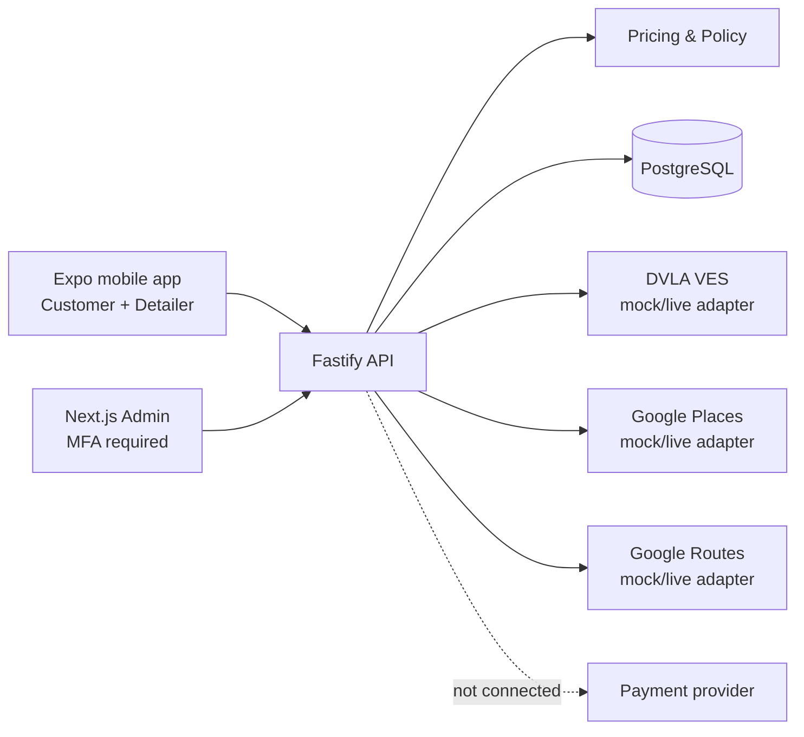

# ValX architecture

## Goals

ValX has one production system serving three role-specific experiences:

- Customers manage vehicles and addresses, choose a service and fulfilment
  mode, receive a locked quote, book, track, review, and raise issues.
- Detailers onboard as subcontractors, declare water/VAT/insurance details,
  manage availability, accept jobs at displayed pay, record arrival and
  before/after evidence, complete work, and receive billing documents.
- Administrators operate customer, detailer, job, finance, trust, policy,
  access, and append-only audit controls behind allowlisted MFA access.

## System shape

The mobile and admin clients never receive provider secrets. All third-party
calls run through the API. Pricing is calculated server-side from the shared
package and a quote snapshot is stored so later rule changes cannot alter an
accepted booking.

## Workspace responsibilities

### `apps/mobile`

Expo SDK 57 / React Native 0.86. It contains invite-only customer and detailer
authentication, database-backed onboarding, booking and job-status flows,
support and account deletion. Session tokens use the native keychain/keystore.
Camera/evidence capture and notifications remain later gates.

### `apps/admin`

Next.js 16. The approved dashboard has been imported as the starting UI. Preview
mode is deliberately explicit. A production identity provider, allowlist, MFA,
role checks, CSRF protection, and short idle sessions are launch requirements.

### `apps/api`

Fastify is the shared trust boundary. It exposes health, authentication,
onboarding, server-persisted quotes, booking, detailer acceptance/status,
support, deletion, policies and provider adapters. Passwords use salted scrypt;
opaque session tokens are stored only as keyed hashes and are revocable. It has
no payment endpoints.

### Shared packages

- `brand` is the only identity token source: ValX, orange `#FF8A1F`, no slogan.
- `pricing-policy` owns approved constants, calculations, and policy text.
- `integrations` hides live and mock providers behind stable interfaces.
- `database` owns Drizzle schema, SQL migration, and connection construction.

## Booking data flow

1. Customer selects vehicle, service, address, and fulfilment mode.
2. API obtains a route distance or accepts a validated distance estimate.
3. API calculates a quote and returns its complete breakdown.
4. The API stores the quote snapshot with a 15-minute expiry.
5. Customer confirms a private-beta booking request. Payment remains
   `not_connected`.
6. An eligible invited detailer accepts the unassigned offer atomically.
7. Detailer records arrival, at least three before photographs, work status,
   at least three after photographs, and any blemish notes.
8. Completion creates a self-billing statement or VAT self-billing invoice.
9. Future payment orchestration may capture customer funds and send the locked
   subcontractor payout, but it must not change the quoted pricing rules.

## Database boundaries

The first migration includes users, detailer profiles, vehicles, addresses,
quotes, bookings, job evidence, versioned policies, and an audit log. Payment
credentials are intentionally absent. When payments are added, only provider
tokens and masked display values may be stored.

## Delivery stages

1. Foundation: approved imports, monorepo, rules, API adapters, schema, mock
   modes, tests, and documentation.
2. Private beta (current): customer/detailer auth, database repositories,
   onboarding, booking acceptance/status, support, deletion, staging and store
   build profiles.
3. Operational beta: admin OIDC + MFA, email recovery, evidence capture,
   schedule, notifications, complaints, observed audit trails and restore test.
4. Controlled payment pilot: separately approved payment integration, DVLA
   live credentials, Google production project, observability and security
   review.
